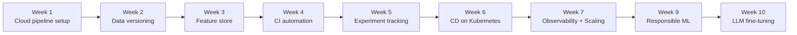

# MLOps Weekly Assignments

This repository tracks week-wise progress for building and scaling an IRIS ML pipeline across MLOps stages.

## Week-wise Learning Summary

| Week | Core Focus | Key Learning Outcome | Branch |
|---|---|---|---|
| 1 | Vertex AI + GCS pipeline setup | Built training/inference workflow on cloud storage with run logs | [`week_1`](https://github.com/pradeepmondal/MLOPs-Weekly-Assignments/tree/week_1) |
| 2 | Data Version Control (DVC) | Versioned data/model assets and verified rollback/reproducibility | [`week_2`](https://github.com/pradeepmondal/MLOPs-Weekly-Assignments/tree/week_2) |
| 3 | Feast Feature Store | Defined entities/features and materialized online/offline features for training/inference | [`week_3`](https://github.com/pradeepmondal/MLOPs-Weekly-Assignments/tree/week_3) |
| 4 | Continuous Integration (CI) | Added automated data/model tests on push and pull request | [`week_4`](https://github.com/pradeepmondal/MLOPs-Weekly-Assignments/tree/week_4) |
| 5 | MLflow tracking & registry | Logged experiments/metrics and integrated model registration workflow | [`week_5`](https://github.com/pradeepmondal/MLOPs-Weekly-Assignments/tree/week_5) |
| 6 | Continuous Deployment (CD) | Containerized API and deployed pipeline to Kubernetes (GKE) | [`week_6`](https://github.com/pradeepmondal/MLOPs-Weekly-Assignments/tree/week_6) |
| 7 | Observability, stress testing, scaling | Added tracing/logging, load testing setup, and HPA-based autoscaling | [`week_7`](https://github.com/pradeepmondal/MLOPs-Weekly-Assignments/tree/week_7) |
| 9 | Responsible ML (fairness, explainability, governance) | Evaluated bias with Fairlearn, interpretability with SHAP, and drift/governance ideas | [`week_9`](https://github.com/pradeepmondal/MLOPs-Weekly-Assignments/tree/week_9) |
| 10 | Foundation model fine-tuning | Fine-tuned Gemma-4-e2b on IRIS data variants and reviewed outcomes | [`week_10`](https://github.com/pradeepmondal/MLOPs-Weekly-Assignments/tree/week_10) |

> Note: No separate `week_8` branch is currently available in the repository.

## Learning Progression Infographic

